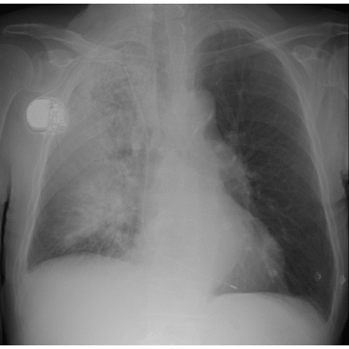

# COVID-19 detection on lung X-ray and CT images using Deep Convolutional Networks

This project created as the semester homework for Deep Learning in Practice with Python and LUA (VITMAV45) course at 2020/21/1 period.

Team name: GreatPeakyKoders

The chosen task is to train and evaulate a convolutional neural network for COVID-19 detection on lung X-ray and images.

The used datasets are the CovidX four subsets:  
-[Covid chestxray](https://github.com/ieee8023/covid-chestxray-dataset)  
-[Actualmed COVID-19 Chest X-ray Dataset Initiative](https://github.com/agchung/Actualmed-COVID-chestxray-dataset)  
-[Figure 1 COVID-19 Chest X-ray Dataset Initiative](https://github.com/agchung/Figure1-COVID-chestxray-dataset)  
-[Covid19 radiography database on Kaggle](https://www.kaggle.com/tawsifurrahman/covid19-radiography-database)  

These images were collected from different hospitals during the 2019-20 Corona virus pandemic. They are not always shows just this specific disease, there several other types too.

Milestone #1:
Collecting, separating, preprocessing the data.

Milestone #2:
Constructing, traning, and testing a basic Convolutional Neural Network on the dataset.

Creators and contacts: Jakab Farkas (BERPAX) [@jakabfarkas](https://github.com/jakabfarkas), Zsombor Szalay (FONP0O) [@ZsomBEAST](https://github.com/ZsomBEAST), Bálint Szegedi (GWCSU3) [@balszeg](https://github.com/balszeg)
